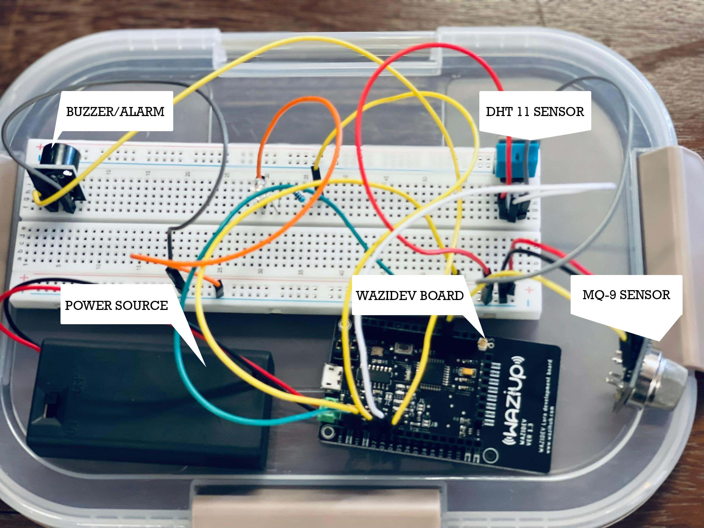
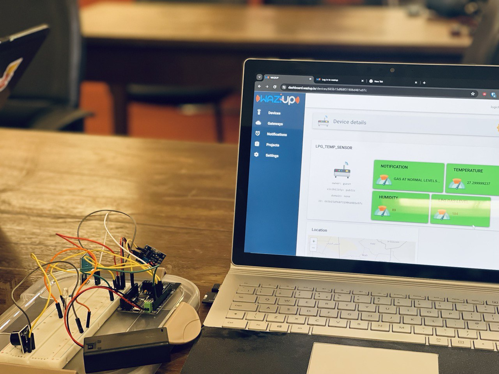

# 🔥 **LPG Sensor - Gas Leak Detection and Alert System** 🚨

## 📋 **Project Overview**
The **LPG Sensor** is an **IoT-based** gas leak detection system designed to alert homeowners of potential gas leaks in their homes. The system utilizes advanced sensors and wireless communication to detect gas leaks and send alerts via SMS or Twitter, ensuring timely action to prevent accidents. 

## ✨ **Key Features**
- 🕵️‍♂️ **Gas leak detection** using high-sensitivity sensors
- 📲 **Real-time alerts** via SMS 
- 🌐 **Remote monitoring** and notification
- 🔋 **Low power consumption** for extended battery life

## ⚙️ **Technical Specifications**
| Specification        | Details                               |
|----------------------|---------------------------------------|
| **Sensor sensitivity** | 50 ppm                               |
| **Wireless range**     | 4 kilometers                         |
| **Power supply**       | Battery-powered (rechargeable)       |
| **Operating temperature** | 0-50°C                           |
| **Humidity range**     | 0-90% RH                             |

## 🛠️ **Hardware Components**
- 🧪 **LPG gas sensor (MQ-9)**
- 🔔 **Buzzer (sound alert)**
- 🌡️ **DHT 11 Temperature & Humidity sensor**
- 💡 **LED bulb (visual signal)**
- 📟 **WaziDev LoRa Development Board**
- 🔌 **Power supply unit**
- 🔋 **Battery and battery management system**

## 💻 **Software Components**
- 🛠️ **Firmware (C++/Arduino)**
- 🐦 **Twitter API integration**
- 📧 **SMS gateway integration**
- ☁️ **Cloud platform integration (WaziCloud through LoRa Gateway)**

## 📶 **Connectivity**
- 📡 **LoRa Network**
- 🛠️ **WaziDev Board**
- ☁️ **Wazi Cloud platform** 
- 🛰️ **LoRa gateway**

## 🔍 **Use Cases**
- 🏠 Homeowners receive alerts during gas leaks, enabling prompt action
- 👵 Remote monitoring for elderly or disabled individuals
- 🏡 Integration with smart home systems
- 🏭 Industrial applications (e.g., factories, warehouses)

## 🚀 **Innovation**
The LPG Sensor combines advanced sensors and wireless communication for real-time gas leak detection and alerting, providing a robust and reliable solution for gas safety.

## 🔧 **Future Enhancements**
- 🚨 Integration with emergency services
- 🌐 Multi-gas detection capabilities
- 🗣️ Voice assistant integration (e.g., Alexa, Google Assistant)
- 📊 Advanced analytics and predictive maintenance
- 🧳 3D enclosure for portability

## 🏁 **Conclusion**
The LPG Sensor is a cutting-edge IoT solution for gas leak detection, prioritizing safety and peace of mind for homeowners. Its innovative design and features make it an essential component of smart home systems, ensuring a safer future for all.

## 🏗️ **Project Architects**
1. 🧑‍💻 Agyenim Boateng Emmanuel
2. 🧑‍💻 Nabil Abubakar
3. 🧑‍💻 Dennis Otchere

## 📸 **Project Prototype**

## 📊 **WaziCloud Dashboard**
Below is an image of the WaziCloud dashboard, depicting real-time data reception from the gas sensor.

